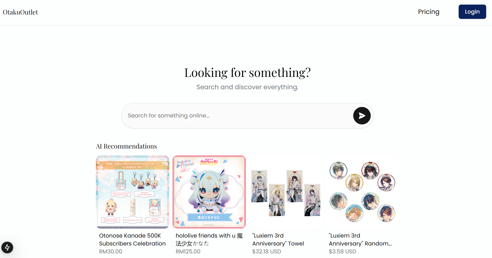
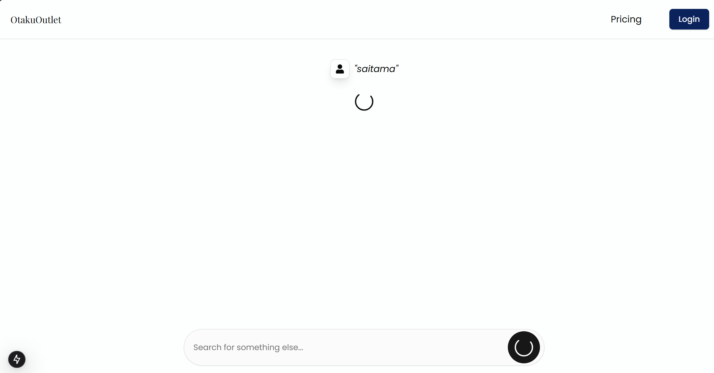
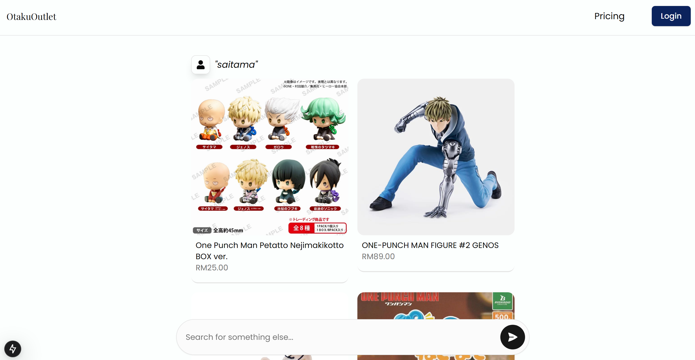

# Anime Scraper

Compare prices and quality of anime merchandise using Puppeteer web scraping! 
(Credits to stan and vin for be and fe collaboration)

## Overview

This project is an Express.js application that scrapes various e-commerce websites for anime merchandise. It extracts keywords from user queries using Google Generative AI and scrapes multiple sites to find matching products. 

## Features

- Extracts keywords from user queries using Google Generative AI.
- Scrapes multiple e-commerce websites for anime, VTuber, and gatcha game merchandise.
- Caches results to improve performance.
- Displays results in a user-friendly format.

 

 

